# LLaMA-Factory Fork Comparison: `LLaMA-Factory-private-rygao-llm` vs `LlamaFactory`

**Compared trees**

| Repo | Path | Snapshot |
|------|------|----------|
| Modified fork (rygao) | `/public/wangyiding/LLaMA-Factory-private-rygao-llm` | ~661 files; not a git repo in this workspace |
| Upstream LlamaFactory | `/public/wangyiding/LlamaFactory` | Git `40e786d0` (main, May 2026) |

**Diff scale (under `src/llamafactory/`):** 89 files with content differences; 22 paths only in the fork; 13 paths only in upstream (excluding `__pycache__`).

---

## 1. Executive Summary

`LLaMA-Factory-private-rygao-llm` is a **private fork** of [hiyouga/LLaMA-Factory](https://github.com/hiyouga/LLaMA-Factory) extended for **large-scale multimodal and text pre-training** inside an internal stack (OpenBee, interleaved wiki+BEE, DCLM/FineWeb Lance corpora, S3/ModelArts). The public README is largely unchanged from upstream; fork-specific behavior lives under `projects/`, `src/llamafactory/hydra_conf/`, `data/backend/`, `docs/`, and `tests_ext/`.

### Scratch pre-training verdict (from-scratch, not continual PT)

**Yes — with its existing modifications, the fork is materially better suited to training LLMs from scratch at scale**, but **not** because weight initialization differs from upstream (both expose the same `train_from_scratch` → `from_config` path). The fork wins on:

1. **Production workflow** — `projects/llm_pretrain` + `tools/random_init_hf_model.py` with token budgets and random-init checkpoints.
2. **Packing correctness** — `neat_packing` + block-diagonal attention via an intentional `stage=sft` workaround (upstream `stage=pt` cannot use `neat_packing`).
3. **Corpus-scale data** — LanceDB streaming backends (`lance2text_pt`) with shard/ID filtering.
4. **Packed-batch loss** — `use_hybrid_sample_token_loss` for fair per-document weighting.
5. **Validation** — gate tests for packing order and attention masks.

**Caveats:** Architecture and tokenizer still come from a Hugging Face skeleton (e.g. Qwen3-Base); Megatron MCA cannot scratch-init; the fork lags upstream on `hyper_parallel`, fuller v1 plugins, and newer Transformers pins; default experiment paths assume internal S3/Lance mounts.

---

## 2. High-Level Diff Matrix

| Subsystem | Upstream | Fork (rygao) |
|-----------|----------|--------------|
| Core train stages (pt, sft, rm, ppo, dpo, kto) | Full | Full (extended) |
| `train_from_scratch` (HF `from_config`) | Yes | Yes (same mechanism) |
| Hydra `projects/` + `hydra_train` | No | **Yes** — 4 projects |
| LanceDB / raw dataset backends | No | **Yes** — `data/backend/lancedb/` |
| `packing_mode` (greedy / offline_multi_pack / sequential) | No | **Yes** |
| Hybrid sample–token loss | No | **Yes** — `model/loss/` |
| Ulysses sequence parallel + Qwen3-VL patches | Limited | **Yes** — `parallel/`, `model_patch/` |
| Interleaved MM dataset format | No | **Yes** — `formatting: interleaved` |
| `plain_text` PT template | No (v1 has internal plain-text check only) | **Yes** |
| `projects/llm_pretrain` (scratch text PT) | No | **Yes** |
| `tools/random_init_hf_model.py` (S3-aware) | No | **Yes** |
| `tests_ext` + gate tests | No | **Yes** |
| Internal docs (`docs/lf-code/`, `docs/development/`) | Minimal | **Extensive** |
| v1 trainer (FSDP2 plugins, batching, checkpoint utils) | **More complete** | Partial / divergent |
| `train/hyper_parallel` | **Yes** | No |
| Transformers pin (pyproject) | `>=4.55.0,<=5.6.0` | `>=4.51.0,<=4.57.1` |
| Hydra dependency | No | `hydra-core>=1.3.0` |

---

## 3. Diff Inventory

### 3.1 Fork-only paths (`src/llamafactory/`)

| Path | Role |
|------|------|
| `hydra_conf/` | Hydra ConfigStore schema, lifecycle, callbacks |
| `data/backend/` | Raw dataset backends (LanceDB, converters) |
| `data/patches/` | Iterable memory, formatted-example retry, deterministic batch |
| `data/processor/packing.py` | Standalone packing algorithms |
| `data/mrope.py`, `data/vision_sp_collator.py` | Multimodal RoPE / vision SP collator |
| `model/loss/` | Hybrid / SP-aware loss |
| `model/model_patch/` | Qwen3 / Qwen3-VL forward patches |
| `parallel/` | Ulysses sequence parallel |
| `extras/remote_storage/` | S3/OBS sync |
| `extras/mem_monitor.py` | Memory monitoring |
| `hparams/config_resolver.py` | v2 YAML / path resolution |
| `train/data_trace.py` | Training data trace/debug |
| `train/sft/utils/`, `train/dpo/ktrainer.py` | SFT/DPO helpers |
| `chat/kt_engine.py` | KTransformers chat engine |
| `model/model_utils/ktransformers.py` | KTransformers integration |

**Top-level (outside `src/llamafactory/`):**

- `src/hydra_train.py` — Hydra entry
- `projects/` — `openbee`, `interleaved`, `llm_pretrain`, `openbee_scale_down`
- `tests_ext/` — extended + gate tests
- `tools/` — 12 Python utilities (Lance builders, random init, FSDP merge, etc.)
- `docs/lf-code/`, `docs/development/`, `docs/testing/`, `docs/ai-assisted/`
- `examples/new_config/` — v2 YAML tree

### 3.2 Upstream-only paths (fork lacks or lags)

| Path | Role |
|------|------|
| `train/hyper_parallel/` | Hyper-parallel training integration |
| `v1/core/utils/batching.py`, `checkpoint.py`, `inference_engine.py` | v1 batching / checkpoint / inference |
| `v1/plugins/trainer_plugins/distributed/fsdp2.py`, `hub.py` | v1 FSDP2 + hub |
| `v1/plugins/trainer_plugins/batching.py`, `optimizer.py`, `lr_scheduler.py` | v1 trainer plugins |
| `v1/plugins/model_plugins/deepspeed_utils.py`, `parallelization/`, `templates/` | v1 model plugins |
| `v1/utils/callbacks/`, `objects.py` | v1 utilities |

### 3.3 Heavily modified shared files (sample)

`data/loader.py`, `data/collator.py`, `data/converter.py`, `data/template.py`, `data/processor/supervised.py`, `data/processor/pretrain.py`, `model/loader.py`, `model/patcher.py`, `hparams/parser.py`, `hparams/data_args.py`, `hparams/finetuning_args.py`, `hparams/training_args.py`, `train/tuner.py`, `train/sft/workflow.py`, `train/mca/workflow.py`, and most trainer modules.

---

## 4. New Features in the Fork (by theme)

### 4.1 Hydra projects and v2 config

- **Entry:** `torchrun -m src.hydra_train --config=projects/<project>/configs/config.py -- experiment=<name>`
- **Guide:** `projects/README.md`
- **Schema:** `src/llamafactory/hydra_conf/schema.py`, `lifecycle.py`
- **Projects:**
  - `openbee` — BEE multimodal SFT (stages 1–3)
  - `interleaved` — wiki + BEE Lance interleaved training
  - **`llm_pretrain`** — DCLM / FineWeb **text scratch pre-training** (Qwen3 0.6B–8B)
  - `openbee_scale_down` — NPU/GPU scaledown experiments

Path conventions: `model_dir_base_local/remote` + `model_name`, `output_dir_base_*` + `exp_name` (resolved in `hparams/parser.py`, `extras/misc.py`).

### 4.2 LanceDB and raw dataset backends

- **Doc:** `docs/development/multi-dataset-backend-support.md`
- **Code:** `src/llamafactory/data/backend/lancedb/`
- **Registrations:** `lance_raw`, `lance2sharegpt`, `lance2openai`, **`lance2text_pt`**
- **Tools:** `build_lance_media_cache.py`, `build_lance_scalar_index.py`, `build_lance_text_id_list.py`, `benchmark_lancedb_getitem.py`

Supports lazy index merge, streaming + `streaming_offline_shuffle`, `include_ids_file` / `exclude_ids_file`, and high shard counts (e.g. 512) for iterable datasets.

### 4.3 Advanced packing and loss

- **`packing_mode`:** `greedy` | `offline_multi_pack` | `sequential` (`hparams/data_args.py`)
- **`neat_packing`:** block-diagonal attention (SFT stage only — see §5)
- **`shuffle_on_packs`:** reproducible pack shuffle
- **`use_hybrid_sample_token_loss`:** balances per-token vs per-sample loss in packed sequences
- **Doc:** `docs/lf-code/packing.md`, `docs/lf-code/loss.md`

### 4.4 Multimodal and scale-out training

- **Ulysses SP:** `src/llamafactory/parallel/ulysses/`, `docs/development/ulysses_sp.md`
- **Qwen3-VL patches:** `src/llamafactory/model/model_patch/qwen3_vl/`
- **Online chunking:** `allow_online_chunking` on templates; logic in `processor_utils.py` / `supervised.py`
- **Interleaved converter:** `formatting: interleaved` in `data/converter.py`
- **Deterministic global batch:** `data/patches/deterministic_batch.py` for reproducible multi-GPU batches

### 4.5 Scratch checkpoint tooling

- **`tools/random_init_hf_model.py`:** copies config/tokenizer from an HF layout, builds weights with `from_config` + fixed seed, supports local and `s3://` (moxing)
- Output used as `Qwen_randinit/Qwen3-*-Base-s42` in `llm_pretrain` experiments

### 4.6 Operations, testing, and docs

- **Remote sync:** `extras/remote_storage/`, `use_s3_tools: modelarts`
- **Gate tests:** `tests_ext/gate/` (packing order, attention mask, Megatron LR, Qwen3-VL dtype)
- **Makefile:** `make test` includes `tests_ext`
- **Chinese internals:** `docs/lf-code/` (dataset, packing, loss, gradient checkpointing)

---

## 5. Upstream Features the Fork Lacks or Lags

| Area | Upstream | Fork gap |
|------|----------|----------|
| **hyper_parallel** | `train/hyper_parallel/` | Not present |
| **v1 FSDP2 / batching / checkpoint** | Full plugin set under `v1/` | Different/partial v1 layout (`batching_queue.py`, `accelerate.py` vs upstream `fsdp2.py`, `batching.py`) |
| **Transformers** | Up to 5.6.x | Capped at 4.57.1 |
| **PEFT** | `>=0.18.0` | `<=0.17.1` |
| **Latest upstream fixes** | e.g. MiniCPM-V plugin (#10500) | Fork snapshot may not include recent commits |
| **Public scratch-PT examples** | `examples/train_lora/qwen3_lora_pretrain.yaml` (continual PT) | Fork relies on Hydra `llm_pretrain` (not in README) |

Megatron-core (MCA), NPU docker, and standard `stage=pt` remain available in **both** repos via upstream code paths.

---

## 6. Scratch Pre-Training Deep Dive

This section answers: **Is the fork better at pre-training LLMs from scratch (random weights, billion-token corpora), as opposed to continual pre-training on an existing base model?**

### 6.1 What “from scratch” means in both repos

Neither repository trains a **new architecture defined only in YAML**. Both need a Hugging Face–style directory with at least `config.json` and tokenizer files. “Scratch” means **random weight initialization** while keeping that skeleton.

| Mechanism | Fork | Upstream |
|-----------|------|----------|
| Runtime flag | `train_from_scratch: true` | Same |
| Loader behavior | `from_config()` instead of `from_pretrained()` | Same |
| Offline random checkpoint | **`tools/random_init_hf_model.py`** | Ad-hoc only (e.g. `scripts/convert_ckpt/tiny_qwen3.py`) |
| Megatron MCA | Always `from_pretrained` — **no scratch** | Same |

**Shared loader logic (fork):**

```263:266:/public/wangyiding/LLaMA-Factory-private-rygao-llm/src/llamafactory/model/loader.py
            if model_args.train_from_scratch:
                model = load_class.from_config(config, trust_remote_code=model_args.trust_remote_code)
            else:
                model = load_class.from_pretrained(**init_kwargs)
```

**Upstream (equivalent):**

```169:172:/public/wangyiding/LlamaFactory/src/llamafactory/model/loader.py
            if model_args.train_from_scratch:
                model = load_class.from_config(config, trust_remote_code=model_args.trust_remote_code)
            else:
                model = load_class.from_pretrained(**init_kwargs)
```

Flag definition (both):

```160:163:/public/wangyiding/LLaMA-Factory-private-rygao-llm/src/llamafactory/hparams/model_args.py
    train_from_scratch: bool = field(
        default=False,
        metadata={"help": "Whether or not to randomly initialize the model weights."},
    )
```

**Important:** Current `llm_pretrain` experiments use **pre-built** `Qwen_randinit/*` checkpoints (`from_pretrained` on random-init dirs), not `train_from_scratch: true` in YAML.

---

### 6.2 Upstream path: `stage=pt` (continual-PT oriented)

**Workflow:** `train/pt/workflow.py` → `PretrainDatasetProcessor` → `DataCollatorForLanguageModeling(mlm=False)`.

**Default packing for PT:** concatenate tokenized documents, chunk to `cutoff_len`, drop remainder:

```39:48:/public/wangyiding/LlamaFactory/src/llamafactory/data/processor/pretrain.py
        else:
            tokenized_examples = self.tokenizer(text_examples, add_special_tokens=False)
            concatenated_examples = {k: list(chain(*tokenized_examples[k])) for k in tokenized_examples.keys()}
            total_length = len(concatenated_examples[list(concatenated_examples.keys())[0]])
            block_size = self.data_args.cutoff_len
            total_length = (total_length // block_size) * block_size
            result = {
                k: [t[i : i + block_size] for i in range(0, total_length, block_size)]
                for k, t in concatenated_examples.items()
            }
```

**Limitation for scratch PT:** `neat_packing` is **disallowed** unless `stage=sft`:

```300:305:/public/wangyiding/LlamaFactory/src/llamafactory/hparams/parser.py
    if finetuning_args.stage != "sft":
        if training_args.predict_with_generate:
            raise ValueError("`predict_with_generate` cannot be set as True except SFT.")

        if data_args.neat_packing:
            raise ValueError("`neat_packing` cannot be set as True except SFT.")
```

So upstream PT packing allows **cross-document attention within a block** (standard concat packing). Fork docs (`docs/lf-code/packing.md`) document this as incorrect for multi-document blocks compared to neat packing.

**Typical upstream example:** LoRA continual PT on `Qwen3-4B-Instruct` + `c4_demo` — not random-init billion-token runs.

---

### 6.3 Fork path: `projects/llm_pretrain` (scratch-PT production)

The fork uses an **intentional `stage=sft` workaround** to enable `neat_packing`, hybrid loss, and the supervised packing pipeline on raw text.

**Finetuning defaults:**

```8:18:/public/wangyiding/LLaMA-Factory-private-rygao-llm/projects/llm_pretrain/configs/defaults/finetuning.py
FULL_SFT_HYBRID: LazyDict = LazyDict(
    dict(
        finetuning=dict(
            stage="sft",
            finetuning_type="full",
            use_hybrid_sample_token_loss=True,
            hybrid_token_loss_weight=1.0,
            sp_ulysses_degree=1,
            plot_loss=True,
        ),
    ),
```

**Data defaults (Lance text PT):**

```32:59:/public/wangyiding/LLaMA-Factory-private-rygao-llm/projects/llm_pretrain/configs/defaults/data.py
LANCE_TEXT_PRETRAIN: LazyDict = LazyDict(
    dict(
        data=dict(
            dataset_dir="",
            dataset=MISSING,  # NOTE: experiments must select one dataset_info key.
            dataset_info=INLINE_LANCE_DATASET_INFO,
            template="plain_text",
            streaming=True,
            streaming_offline_shuffle=True,
            to_iterable_dataset_num_shards=512,
            data_shared_file_system=False,
            cutoff_len=MISSING,  # NOTE: experiments must set the target pretrain sequence length.
            packing=True,
            neat_packing=True,
            shuffle_on_packs=True,
            ...
        ),
        training=dict(
            ...
            dataloader_num_workers=1,
            dataloader_multiprocessing_context="spawn",
            dataloader_persistent_workers=True,
        ),
    ),
```

**`plain_text` template** — avoids forcing chat EOS semantics during raw PT:

```1041:1051:/public/wangyiding/LLaMA-Factory-private-rygao-llm/src/llamafactory/data/template.py
# NOTE: This template intentionally keeps the tokenizer's native EOS token.
# Do not set stop_words/replace_eos here: plain-text pretraining should not
# force Qwen chat EOS semantics such as <|im_end|> unless the tokenizer already
# defines them as its eos_token.
register_template(
    name="plain_text",
    format_user=StringFormatter(slots=["{{content}}"]),
    format_assistant=StringFormatter(slots=["{{content}}"]),
    efficient_eos=True,
    allow_online_chunking=True,
)
```

**Experiment matrix (excerpt):** DCLM / FineWeb, Qwen3 0.6B–8B, random-init model names, token budgets via `max_steps` × effective tokens per step:

```62:71:/public/wangyiding/LLaMA-Factory-private-rygao-llm/projects/llm_pretrain/configs/experiments/train.py
MODEL_SIZE_OVERRIDES["1p7b"] = {
    "training": {
        "fsdp_device_mesh_shard_size": 8,
        "model_name": "Qwen_randinit/Qwen3-1.7B-Base-s42",
        "max_steps": 56_443,     # 28.8B tokens on packing
        "warmup_ratio": 0.0886,  # about 5k steps
        ...
    },
    "data": {
        "cutoff_len": 8192,     # on 64 ranks = 2048 * 256 ranks
    },
```

**Launch example (from experiment file header):**

```bash
PYTHONPATH=src torchrun --nproc_per_node=1 --standalone -m src.hydra_train \
    --config=projects/llm_pretrain/configs/config.py -- experiment=dclm_baseline_1p7b_debug
```

**Offline random init (before training):**

```bash
python tools/random_init_hf_model.py \
    s3://bucket/.../Qwen/Qwen3-1.7B-Base/ \
    /path/to/random_model --seed 42
```

---

### 6.4 End-to-end flow comparison

```mermaid
flowchart TD
  subgraph upstreamScratch [Upstream: scratch-capable but PT-limited]
    U0[HF config + tokenizer skeleton]
    U1["Optional train_from_scratch at load"]
    U2["stage=pt + PretrainDatasetProcessor"]
    U3["Concat packing - cross-doc attention in block"]
    U4["HF Hub / file datasets"]
  end

  subgraph forkScratch [Fork: production scratch PT]
    F0[HF config + tokenizer skeleton]
    F1["random_init_hf_model.py -> Qwen_randinit checkpoint"]
    F2["hydra_train + projects/llm_pretrain"]
    F3["stage=sft + plain_text + neat_packing"]
    F4["Hybrid sample-token loss"]
    F5["Lance lance2text_pt streaming + FSDP2"]
  end

  U0 --> U1 --> U2 --> U3 --> U4
  F0 --> F1 --> F2 --> F3 --> F4 --> F5
```



---

### 6.5 Side-by-side: scratch pre-training capabilities

| Dimension | Upstream | Fork (rygao) | Winner for scratch PT |
|-----------|----------|--------------|------------------------|
| Random weight init API | `train_from_scratch` | Same + offline S3 tool | **Fork** (tooling) |
| PT stage (`stage=pt`) | Native CLM collator | Not used for `llm_pretrain` | Upstream (conceptual simplicity) |
| Document-isolated packing | Not on PT stage | `neat_packing` via SFT | **Fork** |
| Packed-batch loss fairness | Standard mean CE | `use_hybrid_sample_token_loss` | **Fork** |
| Billion-token corpora | HF streaming / files | LanceDB + lazy merge | **Fork** |
| Experiment registry | YAML examples | Hydra `llm_pretrain` matrix | **Fork** |
| Long context defaults | User-defined | 8k–32k in experiments | **Fork** |
| Correctness tests for packing | Basic e2e | `tests_ext/gate` | **Fork** |
| Megatron-scale PT | MCA `from_pretrained` only | Same | Tie (neither scratch) |
| Latest Transformers / v1 | Newer | Older pin | **Upstream** |
| `hyper_parallel` | Yes | No | **Upstream** |

---

### 6.6 Final answer to the focus question

**Is the new repo better at pre-training LLMs from scratch with existing modifications (not continual pre-training)?**

**Yes, for large-scale scratch pre-training on a fixed architecture family (e.g. Qwen3-Base) when you adopt the fork’s intended workflow:**

1. Generate random weights with `tools/random_init_hf_model.py` (or set `train_from_scratch: true` at load).
2. Train via `projects/llm_pretrain` with Lance corpora, `plain_text`, `neat_packing`, and hybrid loss under FSDP2.

**It is not better** if you need:

- A **greenfield architecture** without an HF config/tokenizer template.
- **Megatron MCA** training from random initialization.
- **Upstream’s newest** v1 stack, `hyper_parallel`, or Transformers 5.x without rebasing the fork.
- **Drop-in public cloud** runs without adapting S3/Lance paths.

For **small-scale or continual PT** on an existing checkpoint, upstream’s `stage=pt` path is simpler and officially documented; the fork’s advantages concentrate on **correct packing + corpus scale + operationalized scratch runs**.

---

## 7. Recommendations

| Use case | Recommended repo |
|----------|------------------|
| Billion-token **scratch** PT (Qwen3 + DCLM/FineWeb-style Lance data) | **Fork** — `projects/llm_pretrain` + `random_init_hf_model.py` |
| **Continual PT** on a released base model (LoRA/full, `c4_demo`-scale) | **Upstream** — `stage=pt` examples; simpler mental model |
| **Multimodal** OpenBee / interleaved wiki+BEE at scale | **Fork** — `projects/openbee`, `projects/interleaved` |
| Latest **v1 FSDP2** / **hyper_parallel** / Transformers 5.x | **Upstream** (or rebase fork onto current main) |
| **Megatron-core** large PT (pretrained checkpoint) | Either; MCA scratch-init unsupported in both |
| Packing/loss **correctness** regression testing | **Fork** — `tests_ext/gate` |

---

## 8. Quick Reference Paths

| Goal | Start here |
|------|------------|
| Run scratch text PT | `projects/llm_pretrain/configs/config.py`, `src/hydra_train.py` |
| Random-init checkpoint | `tools/random_init_hf_model.py` |
| Lance data pipeline | `docs/development/multi-dataset-backend-support.md` |
| Packing / loss internals | `docs/lf-code/packing.md`, `docs/lf-code/loss.md` |
| Hydra project guide | `projects/README.md` |
| Upstream PT processor | `LlamaFactory/src/llamafactory/data/processor/pretrain.py` |
| Gate test authoring | `docs/testing/gate-test-dev-guide.md` |

---

*Generated by comparing local trees at `/public/wangyiding/LLaMA-Factory-private-rygao-llm` and `/public/wangyiding/LlamaFactory`.*
